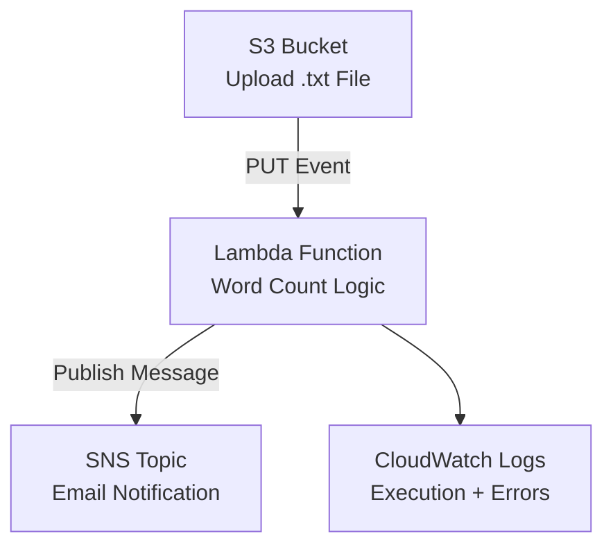

## **📄 Project Summary — S3 → Lambda → SNS Word Count Automation**

This project implements a fully serverless, event‑driven workflow on AWS. When a `.txt` file is uploaded to an S3 bucket, the event automatically triggers an AWS Lambda function. The function reads the file, calculates the total word count, and publishes the result to an Amazon SNS topic. SNS then delivers the notification to subscribed email endpoints.

---

## **🧩 Architecture Overview**



---

## **🔧 Components Used**

### **Amazon S3**
- Stores uploaded `.txt` files  
- Triggers Lambda on `PUT` events  
- Uses suffix filtering to only process `.txt` files  

### **AWS Lambda (Python 3.10)**
- Reads the uploaded file from S3  
- Counts the number of words  
- Publishes the result to SNS  
- Logs execution details to CloudWatch  

### **Amazon SNS**
- Sends email notifications with the word count  
- Requires subscription confirmation  

### **Amazon CloudWatch Logs**
- Captures Lambda execution logs  
- Used for debugging and validation  

---

## **🚀 End‑to‑End Workflow**

1. User uploads a `.txt` file to the S3 bucket  
2. S3 triggers the Lambda function  
3. Lambda:
   - Downloads the file  
   - Counts the words  
   - Publishes the result to SNS  
4. SNS sends an email notification  
5. CloudWatch Logs record the entire execution  

---

## **📂 Suggested Repository Structure**

```
aws-wordcount-project/
│
├── lambda/
│   └── lambda_function.py
│
├── diagrams/
│   └── architecture-mermaid.md
│
├── samples/
│   ├── test1.txt
│   ├── test2.txt
│   └── test3.txt
│
├── docs/
│   ├── troubleshooting.md
│   └── what-i-learned.md
│
└── README.md
```

---

## **🛠️ Troubleshooting (Real Issues Solved)**

### **1. SNS InvalidParameterException**
**Cause:** SNS Topic ARN was not wrapped in quotes  
**Fix:**
```python
SNS_TOPIC_ARN = "arn:aws:sns:us-west-2:XXXXXXXXXXXX:WordCountTopic"
```

---

### **2. S3 Trigger Not Firing**
**Cause:** `.txt` was placed in the *prefix* field instead of *suffix*  
**Fix:**  
- Leave **Prefix** empty  
- Set **Suffix** to `.txt`  
- Check the recursive invocation acknowledgment box  

---

### **3. KeyError: 'Records'**
**Cause:** Lambda was manually tested using the “Test” button  
**Fix:**  
Only test by uploading a file to S3 — Lambda expects an S3 event structure.

---

### **4. SyntaxError in Lambda**
**Cause:** Missing quotes around the SNS ARN  
**Fix:**  
Wrap the ARN in quotes (Python requires strings).

---

### **5. No Email Received**
**Possible causes:**
- SNS subscription not confirmed  
- SNS ARN incorrect  
- Lambda error before publish  

**Fix:**  
Check CloudWatch logs for SNS errors and confirm subscription.

---

## **📚 What I Learned**

- How to build an event‑driven architecture using AWS managed services  
- How S3 event notifications trigger Lambda functions  
- How Lambda interacts with S3 and SNS using IAM permissions  
- How to debug Lambda using CloudWatch Logs  
- How to interpret common AWS errors (syntax, ARN issues, event structure)  
- How to design clean, modular serverless workflows  
- How to validate and test cloud automation end‑to‑end  

This project strengthened my understanding of serverless compute, event triggers, and cloud‑native automation patterns.

---

## 📸 Screenshots

Below are the key screenshots documenting the setup, execution, and results of the Lambda challenge.

### 1. S3 Bucket Configuration
_Add a screenshot showing your S3 bucket and the .txt files you uploaded._


---

### 2. Lambda Function Code
_Add a screenshot of your Lambda function code in the AWS console._


---

### 3. S3 Trigger Configuration
_Add a screenshot showing the S3 trigger attached to your Lambda function._


---

### 4. CloudWatch Logs


